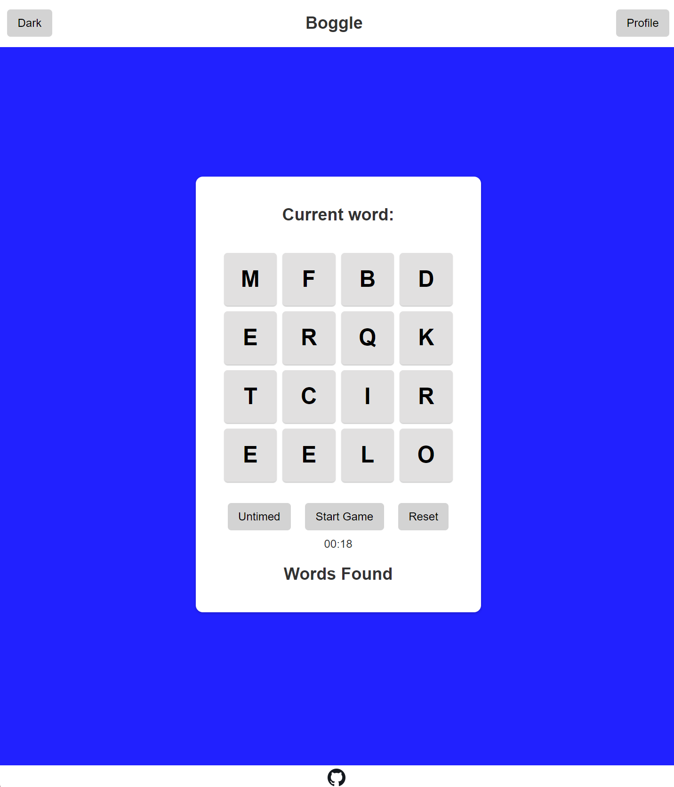
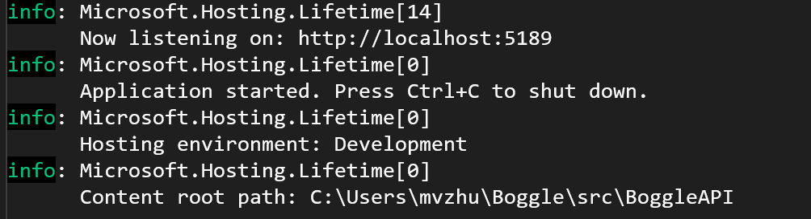
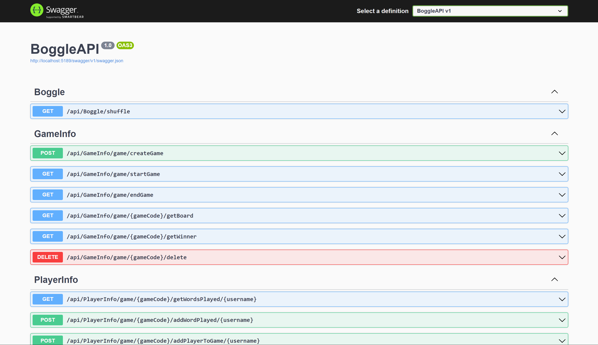
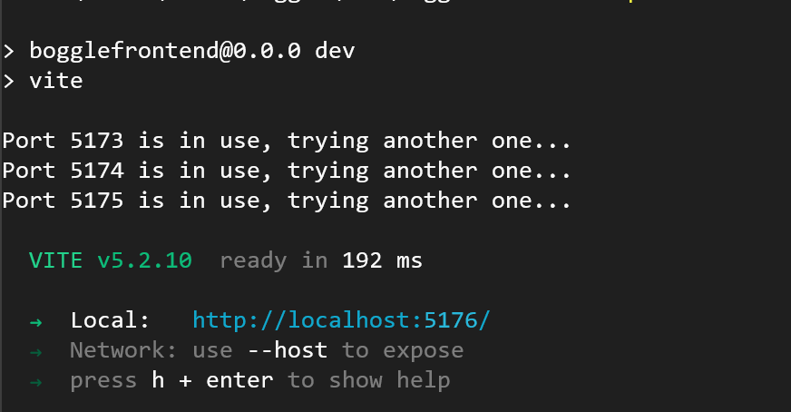

[](https://github.com/Kashish-Syed/Boggle/actions/workflows/run-app.yml)

# Boggle

## Table of Contents
* [Overview](#overview)
	* [Webpage](#webpage)
* [Getting Started](#getting-started)
	* [Prerequisites](#prerequisites)
	* [Installation](#installation)
* [Backend](#backend)
* [Frontend](#frontend)
* [Server (Optional)](#server-optional)
* [Usage](#usage)
* [Testing](#testing)
* [Acknowledgements](#acknowledgements)

## Overview
A word game where each player searches the assortment of letters for words of three letters or more. 
When a player finds a word, they write it down. This game can be played in three ways: single-player 
with or without a timer, and multiplayer with up to eight players.

### Webpage



## Getting Started
Start by getting the prerequisites and cloning the repo:

### Prerequisites
* .NET 8.0
* Node.js

### Installation
1. Clone the repo
	``` sh
	git clone https://github.com/Kashish-Syed/Boggle
	```

## Backend
The backend was implemented in C# and .NET 8.0 and it's made up of the following class libraries:
* `/src/BoggleAccessors`: Class library for accessing the database.
* `/src/BoggleAPI`: Class library for controllers with API endpoints and the TCP server.
* `/src/BoggleContracts`: Class library for storing the class interfaces.
* `/src/BoggleEngines`: Class library for additional app logic.

The project uses the following NuGet packages:
* NUnit, Version: 4.1.0
* NUnit Analyzers, Version: 4.1.0
* NUnit3TestAdapter, Version: 4.5.0
* System.Data.SqlClient, Version: 4.8.6
* coverlet.collector, Version: 6.0.0
* Microsoft.NET.Test.Sdk, Version: 17.8.0

To resolve missing packages run:
``` sh
dotnet add package [package-name]
```

The target file is `Boggle/src/BoggleAPI/Program.cs`.

To run the backend:

1. ``` sh
	cd Boggle
	```
2. ``` sh
	dotnet restore
	```
3. ``` sh
	cd src/BoggleAPI
	```
4. ``` sh
	dotnet run
	```

**Terminal view after dotnet run: **



Finally, go to <http://localhost:5189/swagger/index.html>, to view the Swagger API interface:



Congrats! The backend is now running. :)

## Frontend
The frontend was built with the following build tools and frameworks:

* Vite <https://vitejs.dev/>
* React <https://react.dev/>
* TypeScript <https://www.typescriptlang.org/>

To run the frontend, make sure that the backend is running first. Next, follow these steps:

1. Install Node.js if you don't have it: <https://nodejs.org/en>
2. Next, go to `Boggle\src\BoggleFrontend`, open the terminal and run the following command:
```sh
npm run dev
```
3. This should open the following screen in the terminal:

4. Finally you can go the local host link shown in the terminal 
(<http://localhost:5176/> in this case) to view the Boggle webpage.

## Server (Optional)


## Usage
The Boggle game could be played in 3 ways:
1. As a single player without the timer.
2. As a single player with a timer (default)
3. In multiplayer mode with other players (you will have to sign up to enable this feature).

The objective of the game is to find as many words as you can in the shortest
amount of time on the 16 randomly shuffled die. The longer the word the better the
score.

The scoring for the words is as follows:

| Word Length   | Score         |
| ------------- |:-------------:|
| 2 or less     | 0             |
| 3 or 4        | 1             |
| 5             | 2             |
| 6             | 3             |
| 7             | 5             |
| 8 or more     | 11            |

The player with the highest score wins.

## Testing
The project was tested extensively using unit tests. To run them:

## Acknowledgements
This project was made by:
* Dawson McGahan: [Zepherian04](https://github.com/Zepherian04)
* Kashish Syed: [Kashish-Syed](https://github.com/Kashish-Syed)
* Loc Nguyen: [locnugwin](https://github.com/locnugwin)
* Marie Victoria Zhussupova: [Phychee](https://github.com/phychee)
* Walker Lee: [walkerlee03](https://github.com/walkerlee03)
* Zaiden De La O: [BigZ5709](https://github.com/BigZ5709)
